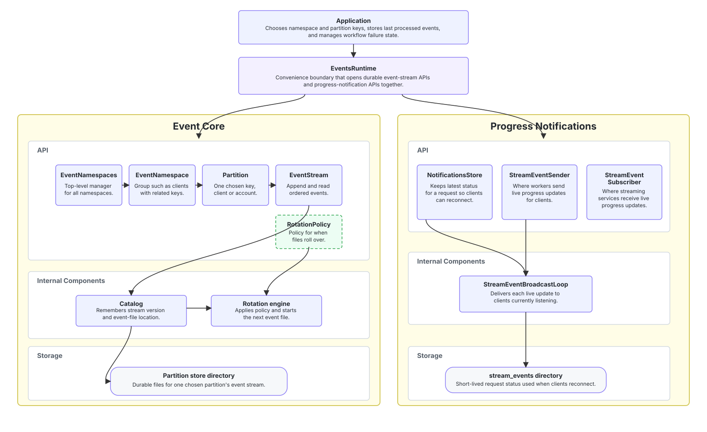

# Architecture

The Events crate implements a durable namespaced and partitioned event stream backed by Turso DB. It also includes a progress-notification path for request status updates; those notifications are separate from the durable event stream.

Stream checkpointing and workflow constructs, with consumer idempotent side effects provide resiliency through continuation retries.

The architecture is designed around several key principles:

- **Immutability**: events are never modified once written
- **Optimistic concurrency**: expected versions protect command decisions
- **Application-owned projection state**: consumer cursor offsets live within the application database
- **Storage abstraction**: application code uses APIs such as `EventStream` and `EventStreamVersion` instead of tracking namespace directories, partition directories, catalog rows, or rotated `events_*.db` files.
- **Notification separation**: progress notifications are transient request status updates, not durable domain events or projection checkpoints.

## Core Architecture



## Key Components

### Runtime Boundary

#### EventsRuntime

`EventsRuntime` is the convenience runtime that opens the durable event-stream API and the progress-notification API together. It owns the event namespace resolver, the notifications store, the stream event sender/subscriber pair, and the broadcast loop. Services that need live progress delivery must spawn the loop with `spawn_broadcast_loop()` or take it with `take_broadcast_loop()` and run it themselves.

### Event Core Components

#### EventNamespaces

`EventNamespaces` is the root manager for all event namespaces under one storage root. It owns the root directory and the rotation policy used by event streams opened through it.

```rust
let namespaces = EventNamespaces::open("./data/events", rotation).await?;
let users = namespaces.ensure_namespace("users").await?;
let partition = users.ensure_partition_exists("user-123").await?;
let stream = partition.open().await?;
```

Namespaces and partition keys are filesystem-safe path segments: lowercase ASCII letters, digits, and `-`.

#### EventNamespace

`EventNamespace` is a named grouping of partitions, such as `users`, `clients`. It ensures partitions exist and lists valid partition-store directories without opening or migrating those stores.

#### Partition

`Partition` is the public reference to one selected partition in an `EventNamespace`. It is not the append/read API itself; opening it returns an `EventStream`.

The partition key is selected by application code before append/read:

```rust
let clients = namespaces.ensure_namespace("clients").await?;
let partition = clients.ensure_partition_exists("client-a").await?;
let stream = partition.open().await?;
```

A partition store is the durable storage behind a `Partition`. The partition key might be a plain `default` key in the simple case where partitioning is not required. In other cases, it should represent the ordering and conflict scope for related events, such as an owner, account, client, or region. Work for different partition keys can then be processed independently.

#### EventStream

`EventStream` is the public append/read API for one ordered event stream. It abstracts the catalog and rotated physical event files, so callers use `EventStreamVersion` rather than file names.

### Event Core Storage Components

#### Catalog Database

Each partition store has a catalog database. The catalog stores event-stream and rotated-file metadata. The snippet below is abridged; the implemented schema is defined in [`src/migration.rs`](../../src/migration.rs).

```sql
CREATE TABLE event_stream_head (
    id INTEGER PRIMARY KEY CHECK (id = 1),
    current_version INTEGER NOT NULL,
    last_event_id TEXT,
    active_partition TEXT
);

CREATE TABLE event_file_ranges (
    name TEXT PRIMARY KEY,
    path TEXT NOT NULL,
    first_version INTEGER NOT NULL,
    last_version INTEGER,
    sealed INTEGER NOT NULL
);
```

`event_stream_head` and `event_file_ranges` describe different parts of the same ordered stream:

```text
catalog.db
├── event_stream_head
│   └── current_version = 125
│       active_partition = events_20260521T10_b.db
│
└── event_file_ranges
    ├── events_20260521T09.db    versions 1..50     sealed
    ├── events_20260521T10.db    versions 51..100   sealed
    └── events_20260521T10_b.db  versions 101..NULL active
```

`event_stream_head` answers "what is the current head of this event stream?" `event_file_ranges` answers "which physical event files contain which event-stream version ranges?" Appends use `event_stream_head.current_version` for expected-version checks and the next version number. Reads use `event_file_ranges` to find the rotated event files that may contain events after the requested `EventStreamVersion`.

**Why a catalog database?**

- **Fast lookup**: find which rotated event database file contains a version range
- **Continuity**: preserve one monotonic `EventStreamVersion` across files
- **Safety**: track the current event stream head independently of event rows
- **Maintenance**: allow event database files to rotate without changing public cursors

#### Rotated Event Files

Each rotated event file is a Turso database containing event rows for a contiguous event-stream version range. The snippet below is abridged; the implemented schema is defined in [`src/migration.rs`](../../src/migration.rs).

```sql
CREATE TABLE events (
    id TEXT PRIMARY KEY,
    type TEXT NOT NULL,
    payload TEXT NOT NULL,
    version INTEGER NOT NULL UNIQUE,
    created_at INTEGER NOT NULL,
    sequence INTEGER NOT NULL,
    workflow_kind TEXT,
    workflow_started_by_event_id TEXT,
    trace_id TEXT,
    span_id TEXT,
    request_id TEXT,
    actor_id TEXT NOT NULL,
    actor_type TEXT NOT NULL
);
```

**Why separate event files per rotation window?**

- **Performance**: active indexes stay bounded
- **Maintenance**: sealed files can be backed up or inspected independently
- **Resource management**: file size limits prevent unbounded active files
- **Cursor stability**: callers keep `EventStreamVersion`, not file names

#### Rotation Engine

`RotationPolicy::TimeWindow` controls when a partition store creates a new physical event database file:

```rust
RotationPolicy::TimeWindow {
    window: Duration::from_secs(3600),
    max_bytes: Some(512 * 1024 * 1024),
}
```

Rotation is physical. It creates another event database file inside the same partition store. It does not create a new partition store, event stream, workflow run, or projection cursor.

### Notification Components

#### NotificationsStore

`NotificationsStore` records the latest progress notification for a request ID with TTL-based expiry. It is for reconnect and status display, not for durable workflow state or projection offsets.

#### StreamEventSender and StreamEventSubscriber

`StreamEventSender` accepts progress updates from workers or projectors. `StreamEventSubscriber` lets gRPC or SSE services subscribe to live progress updates. The broadcast path is best-effort; durable recovery comes from the event stream and application read models.

## Data Flow

### Writing Events

```
┌─────────────────┐    ┌────────────────────┐    ┌────────────────────┐
│   Application   │───▶│ EventNamespaces    │───▶│    EventStream     │
│                 │    │                    │    │                    │
│ choose namespace│    │ select namespace   │    │ validate event     │
│ choose key      │    │ open partition     │    │ check version      │
└─────────────────┘    └────────────────────┘    └──────────┬─────────┘
                                                            │
                                                            ▼
                                                   ┌─────────────────┐
                                                   │  events_*.db    │
                                                   │ insert rows     │
                                                   └────────┬────────┘
                                                            │
                                                            ▼
                                                   ┌─────────────────┐
                                                   │  catalog.db     │
                                                   │ update head     │
                                                   └─────────────────┘
```

1. **Partition store selection**: application chooses namespace and partition key
2. **Validation**: validate safe path segments, payload size, actor fields, and workflow metadata
3. **Concurrency check**: verify `ExpectedVersion`
4. **Database write**: insert event rows into the active event file
5. **Catalog update**: advance the event stream head

If event insertion commits but the catalog head update fails, append returns `CatalogDrift`. Treat that as an operator problem before writing more to the affected partition store.

### Reading Events

```
┌──────────────────────┐    ┌────────────────────────┐
│ Application offset   │───▶│      EventStream       │
│ EventStreamVersion   │    │ load_after_version     │
└──────────────────────┘    └────────────┬───────────┘
                                         │
                                         ▼
                              ┌──────────────────────┐
                              │ catalog version      │
                              │ ranges               │
                              └──────────┬───────────┘
                                         │
                                         ▼
                              ┌──────────────────────┐
                              │ relevant event files │
                              │ ordered batch        │
                              └──────────────────────┘
```

Reads are exclusive: `load_after_version(v2, limit)` returns events after `v2`. `EventStreamVersion::start()` means "before the first event" for reads.

### Projection Processing

```
┌──────────────────┐    ┌──────────────────────┐    ┌─────────────────┐
│   Projector      │───▶│     EventStream      │───▶│  Event batch    │
│                  │    │                      │    │                 │
│ load app offset  │    │ read after cursor    │    │ apply handlers  │
│ update read model│    │ bounded limit        │    │ save app offset │
└──────────────────┘    └──────────────────────┘    └─────────────────┘
```

Projection offsets belong in the application database so read-model changes, active workflow state, and the offset can commit together.

### Workflow Recovery

Workflow identity is independent of partition-store identity. A workflow kind names the retryable business process type, and a workflow started-by event ID identifies one run of that process:

```
┌──────────────────────────────────────────────────────────────┐
│                       Event stream                           │
├──────────────────────────────────────────────────────────────┤
│ v1 UserRegistered                                            │
│ v2 ProvisioningStarted   workflow_started_by_event_id = v2.id│
│ v3 EmailChanged                                              │
│ v4 MachineCreated        workflow_started_by_event_id = v2.id│
└──────────────────────────────────────────────────────────────┘
```

`load_workflow_after_version(started_by_event_id, cursor, limit)` filters by the workflow started-by event ID while preserving event-stream version order.

### Progress Notifications

```
┌──────────────────┐    ┌──────────────────────┐    ┌──────────────────┐
│ Worker or        │───▶│ NotificationsStore   │───▶│ Reconnecting     │
│ projector        │    │ record latest status │    │ client reads it  │
└──────────────────┘    └──────────────────────┘    └──────────────────┘
        │
        │ send live update
        ▼
┌──────────────────┐    ┌──────────────────────┐    ┌──────────────────┐
│ StreamEventSender│───▶│ Broadcast loop       │───▶│ Live subscriber  │
│                  │    │ fan out update       │    │ receives update  │
└──────────────────┘    └──────────────────────┘    └──────────────────┘
```

Progress notifications are request-status messages. They do not replace durable events, workflow recovery, or application-owned projection offsets.

## Concurrency Model

### Optimistic Concurrency Control

The system uses optimistic concurrency control. A command reads state, decides what should happen, and appends with an expected event-stream version:

```
Process A                     Process B
---------                     ---------
Read stream head v5           Read stream head v5
Decide command                Decide command
Append with Exact(v5) ──────▶ Append with Exact(v5)
Success                       Conflict: actual is v6
                              Reload and decide again
```

**Why optimistic concurrency?**

- **No read locks**: commands can inspect state without blocking writers
- **Clear conflicts**: stale decisions fail at append time
- **Domain control**: applications choose retry, merge, or reject behavior
- **Partition-store scope**: conflicts are limited to one partition store

### Version Numbers

`EventStreamVersion` is monotonic inside one partition store:

- stored events start at version `1`
- `EventStreamVersion::start()` is only a before-first read cursor
- `ExpectedVersion::NoStream` requires an empty stream
- `ExpectedVersion::Exact(version)` requires the current head to match
- `ExpectedVersion::Any` blind-appends after the current head

## Error Handling Strategy

### Error Categories

| Category       | Examples                                                | Response                       |
| -------------- | ------------------------------------------------------- | ------------------------------ |
| Caller input   | `InvalidSafeName`, `InvalidVersion`, `InvalidReadLimit` | reject or fix caller           |
| Concurrency    | `Concurrency`                                           | reload state and decide again  |
| Storage        | `Db`, `Io`, `Migration`                                 | retry if safe, otherwise alert |
| Catalog safety | `CatalogDrift`                                          | stop writes and inspect store  |

### Retry Strategy

Retry only when the operation is known to be safe. Do not blindly retry `CatalogDrift`; it means event rows committed but catalog advancement failed.

## Performance Considerations

### Write Performance

Writes are serialized per partition store. Choosing partition keys that match independent units of work distributes write contention.

### Read Performance

Reads are bounded by caller-supplied limits and catalog version ranges. Keep batches large enough to amortize overhead and small enough to bound memory use.

### Memory Management

`EventNamespaces` keeps a bounded idle cache of opened stores. Active `EventStream` handles remain valid even if the resolver evicts its cached entry.

## Design Trade-offs

### Application-Owned Projection State

The event crate does not own projection checkpoints. That adds one application responsibility, but it keeps read-model state and offsets in the same database transaction.

## Summary

The Events crate centers on one ordered event stream per partition store. The crate owns append, read, rotation, catalog mechanics, and best-effort progress-notification delivery. Applications choose partition keys, store projection offsets, and manage active workflow state.
