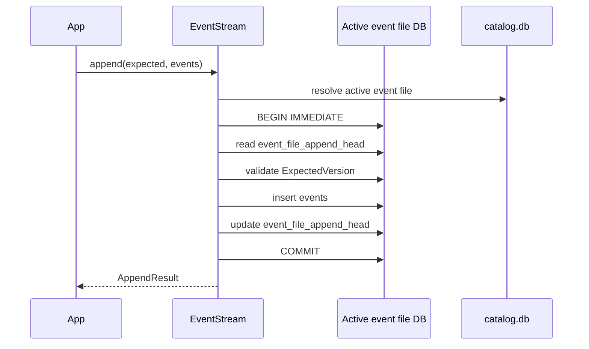
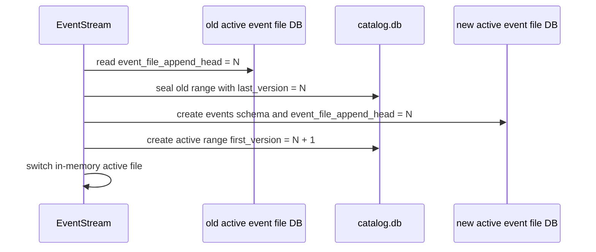

# Local Append Head

## Status

Spec draft. This document is a pre-implementation spec for the `events` crate and must be checked against the final code before being migrated into permanent docs.

## Problem Framing

`EventStream::append` currently commits event rows to the active event file DB and then updates `catalog.db.event_stream_head`. That creates a split durability boundary: if the process or machine fails after the event file commit but before the catalog head update, committed events can exist beyond the catalog head. `CatalogDrift` detects one normal error path after commit, but it does not make recovery automatic, and a manual repair requirement is not acceptable for append correctness.

The practical maintainer and operator questions are:

- Which table is authoritative for allocating the next event-stream version?
- Which metadata is append-critical and must commit with event rows?
- Which catalog metadata is routing metadata that can be rebuilt from event files?
- What happens after a crash during append, rotation, or catalog update?
- How can reads still traverse all rotated event files without making `catalog.db` the authoritative append head?

Terminology:

- Use `EventStream` for the logical append/read API.
- Use `partition store` for the physical store directory containing `catalog.db` and rotated event files.
- Use `event file` for one rotated Turso DB file that stores event rows.
- Use `local append head` for the authoritative mutable head stored in the active event file DB.
- Avoid `eventstore`, `event log head`, `owner log`, and Turso DB misnamings in this task unless quoting old planning material.

## Goal

Move append-critical head state into the same Turso DB file as the mutable event rows. Appending a batch must insert events and advance that file's local append head in one database transaction, so an append either fully commits both facts or commits neither.

Keep `catalog.db` responsible for routing across rotated event files. The catalog may store sealed file ranges and active-file identity, but it must not be the only authoritative source of the latest mutable event-stream version.

## Non-Goals

- Do not rely on `ATTACH DATABASE` for crash atomicity across `catalog.db` and event file DBs.
- Do not add a manual operator repair workflow as the primary correctness mechanism.
- Do not change application-owned projection offsets or workflow recovery ownership.
- Do not introduce cross-partition ordering or a global cursor.
- Do not rename public concepts outside the scope needed for the head/catalog authority split.
- Do not preserve compatibility with branch-local intermediate schemas if no production data exists.
- Do not add transitional compatibility support for `catalog.db.event_stream_head`; remove the old authoritative catalog-head path instead of retaining it as a cache.

## Update Type

- Primary update type: storage/data contract change.
- Secondary update type: architecture/design decision with caller-visible error semantics.
- Likely permanent documentation impact: update architecture, SQL/schema reference, error types, monitor-production, and rotation docs.
- Existing docs likely affected:
  - `docs/explanation/architecture.md`
  - `docs/explanation/partitioning-strategy.md`
  - `docs/reference/error-types.md`
  - `docs/reference/api.md`
  - `docs/how-to/monitor-production.md`
  - `docs/how-to/configure-rotation.md`
  - `docs/how-to/migrate-schema.md`

## Current Context

Current schema:

- `src/migration.rs` creates `events` in each event file DB.
- `src/migration.rs` creates `event_file_ranges` and `event_stream_head` in `catalog.db`.
- `event_stream_head` currently stores `current_version`, `last_event_id`, and `active_partition`.

Current append flow:

```text
EventStream::append
  validate events
  rotate if needed
  read catalog head for current_version
  BEGIN IMMEDIATE on active event file DB
  insert events into active events table
  COMMIT active event file DB
  update catalog.db event_stream_head
  if catalog update fails, return CatalogDrift
```

Current rotation flow:

```text
rotate_partition
  read catalog head
  seal active event_file_range with head.current_version
  create next event file range with first_version = head.current_version + 1
  switch active in memory
```

Current failure:

```text
event file DB committed version N
catalog.db head still N - 1
next append reads stale catalog head
```

The local TursoDB proof showed that `ATTACH DATABASE` can coordinate ordinary commit and rollback while the process is alive, but an explicit process-kill stress test produced drift: the main event DB advanced to version `131` while the attached catalog DB remained at `130`. The TursoDB source explains this as a non-atomic multi-phase commit across attached databases. This task must therefore avoid cross-file commit atomicity as an append correctness assumption.

## Behavior Contract

Happy path:

- Opening a partition store locates the active event file from catalog routing metadata.
- The active event file DB stores an append head table with the latest committed version and last event ID for that file.
- Append reads the current head from the active event file DB, validates `ExpectedVersion`, inserts event rows, and advances the local append head in one `BEGIN IMMEDIATE` transaction on that same DB.
- After append commits, `current_version()` reports the committed version from the active event file head.
- Reads still use catalog file ranges to traverse sealed and active event files in event-stream version order.

Rotation:

- Before sealing the active file, rotation reads the active file's local append head.
- Rotation records that value as the sealed range's `last_version`.
- Rotation creates the next event file with `first_version = sealed_last_version + 1` and initializes the next file's local append head so future appends allocate versions from that boundary.
- After rotation, the new active file owns append version allocation.

Recovery:

- If the process crashes during append before commit, neither event rows nor the local append head advance.
- If the process crashes after append commit, both event rows and the local append head are present in the active event file DB.
- If the process crashes while updating catalog routing metadata, the implementation must be able to reconcile `event_file_ranges` from event file metadata and event rows before allowing writes that depend on stale routing metadata.
- Catalog routing metadata is repairable; event row versions and local append heads are authoritative for mutable append state.

Existing behavior that must not regress:

- Event versions remain monotonic within one `EventStream`.
- Stored event versions still start at `1`.
- `EventStreamVersion::start()` remains the read cursor before the first event and is not accepted as `ExpectedVersion::Exact`.
- `ExpectedVersion::NoStream`, `ExpectedVersion::Exact`, and `ExpectedVersion::Any` keep their current public meanings.
- Read limits remain bounded and invalid limits remain validation errors.
- Workflow metadata remains event-row metadata and is not part of append head authority.

## Contract Surface

Public or cross-module contract changes are required.

Data contracts:

| Name | Kind | Fields / shape | Validation rules | Ownership / lifetime | Compatibility notes |
| ---- | ---- | -------------- | ---------------- | -------------------- | ------------------- |
| `event_file_append_head` | event file DB table | single row: `id = 1`, `current_version`, `last_event_id` | `id` is fixed at `1`; `current_version` must not decrease; `last_event_id` is nullable only for an empty file | Owned by the active or sealed event file DB; authoritative for that file's committed append head | New table in partition/event file migrations |
| `event_file_ranges` | catalog DB table | `name`, `path`, `first_version`, `last_version`, `sealed` | sealed ranges must have `last_version`; active range has no `last_version` until sealed | Owned by `catalog.db`; routing metadata across event files | Remains in catalog and becomes repairable derived metadata |
| `event_stream_head` | catalog DB table | current table with `current_version`, `last_event_id`, `active_partition` | removed from the live storage contract | Not retained as a compatibility cache | Must not be the source of expected-version validation after this change |

Callable contracts:

| Function / method / command | Caller | Inputs | Output / result | Error variants | Side effects | Compatibility notes |
| --------------------------- | ------ | ------ | --------------- | -------------- | ------------ | ------------------- |
| `EventStream::append` | application command handlers | `ExpectedVersion`, events | `AppendResult` with first/last version and envelopes | existing validation, DB, concurrency errors; `CatalogDrift` should narrow or disappear for head updates | inserts event rows and advances local append head in one event file transaction | Public method shape should remain stable unless implementation proves a narrower error surface |
| `EventStream::current_version` | applications and tests | none | latest stream version or start cursor | DB/open/recovery errors | reads active file append head or derived empty state | Result semantics remain the same |
| rotation internals | `EventStream` | current time and rotation policy | active file switch | DB/recovery errors | seals old catalog range and creates new event file/head | Cross-module storage behavior changes; public rotation policy should remain stable |
| catalog recovery/reconciliation helper | `EventStream::open` and rotation paths | partition store root/catalog | repaired routing metadata or error | DB/migration/recovery errors | may update `event_file_ranges` before writes continue | Can be internal initially |

## Failure Modes

| Failure mode / trigger | Description | Expected behavior | State or persistence effect | User/operator feedback | Verification |
| ---------------------- | ----------- | ----------------- | --------------------------- | ---------------------- | ------------ |
| Append validation fails | Events are invalid before any DB transaction starts. | Reject without mutation. | No event rows, no local head change, no catalog change. | Existing validation error. | Unit/integration tests for invalid event metadata and limits. |
| Append insert fails | Event row insert fails inside the active event file transaction. | Roll back the transaction. | No partial event rows and no local head advancement. | DB error or mapped concurrency error. | Fault-injection or duplicate-version test. |
| Local head is invalid or missing | The active event file cannot provide its singleton append-head row before append. | Reject before inserting event rows. | No partial event rows beyond the previous local head. | DB or migration error; not `CatalogDrift`. | Integration test with a missing local-head row. |
| Process crash before append commit | Process exits during active event file transaction. | Reopen sees either old state only or a fully committed event/head pair. | Event rows and local head do not diverge. | No operator action for head repair. | Process-kill stress test against one event file DB. |
| Process crash after append commit | Process exits after event file commit but before catalog routing update. | Reopen derives latest mutable head from active event file and reconciles catalog routing before writes. | Event file remains authoritative; catalog may be repaired. | Operator logs recovery if catalog routing was repaired. | Crash/reopen test that kills between append and catalog follow-up. |
| Rotation crashes after sealing old range | Old range may be sealed but new range may not exist or be incomplete. | Reopen repairs or completes active range selection from event file metadata. | No version reuse; sealed `last_version` remains derived from old file head. | Recovery log or DB error if ambiguous. | Rotation crash/reopen tests. |
| Catalog missing or stale active range | `catalog.db` does not identify the correct active event file. | Reconcile from event files; refuse writes only if ambiguity cannot be resolved. | Routing metadata repaired before append. | Recovery log or explicit recovery error. | Integration test with edited/stale catalog rows. |
| Multiple unsealed ranges | Catalog contains more than one unsealed event file range. | Resolve using event file versions if one latest file is unambiguous; otherwise return recovery error. | No append until routing is repaired or ambiguity is handled deterministically. | Explicit recovery error naming the partition store. | Catalog corruption test. |
| Sealed file receives append | A stale active handle tries to append to a file that is no longer active. | Reject or refresh active state before append; do not write to sealed file. | No mutation to sealed file. | DB/recovery/concurrency error. | Concurrent rotation/append test if practical. |

## Test Theories

| Theory / behavior | Case | Description | Starting state | Input / action | Expected response | Expected state / side effects |
| ----------------- | ---- | ----------- | -------------- | -------------- | ----------------- | ----------------------------- |
| Append head atomicity | missing local head row | Remove the singleton local append-head row. | Active file has one committed event and no local-head row. | Append event `N + 1`. | Append returns error. | No event row `N + 1` is inserted. |
| Append head atomicity | process kill during append | Kill a child process while it loops appends. | Active file initialized with local head. | Reopen store after each kill. | Open succeeds. | `MAX(events.version) == local_head.current_version`. |
| Catalog is derived routing | stale catalog-head remnants | Manually leave stale old catalog-head data or remove old catalog-head data. | Event file contains committed rows and local head. | Open and append. | Open ignores/removes stale catalog-head remnants. | Append uses local head and does not reuse versions. |
| Rotation boundary | seal old active file | Rotate after appends. | Active file head is `N`. | Trigger rotation. | New active file first version is `N + 1`. | Old range sealed with `last_version = N`; new local head starts at `N`. |
| Recovery from routing drift | crash after append before catalog repair | Simulate event file committed beyond catalog routing metadata. | Catalog active range stale; active event file has local head `N`. | Reopen and call `current_version`/append. | Reports/uses `N`; repair occurs or write is refused only on ambiguity. | No version reuse; catalog ranges are consistent afterward. |

## Proposed Approach

Target storage authority:

```text
partition store
├── catalog.db
│   └── event_file_ranges        # routing across event files; repairable
├── 2026...a.db
│   ├── events                   # immutable after seal
│   └── event_file_append_head   # final head for this file
└── 2026...b.db
    ├── events                   # mutable active file
    └── event_file_append_head   # authoritative append head for current writes
```

Append sequence:



Rotation sequence:



Design details:

- Add event file migration for `event_file_append_head`.
- Move expected-version validation to use the active event file's local head.
- Move append head advancement into the same transaction as event row insertion.
- Keep catalog range traversal for reads, but do not use catalog head for append version allocation.
- Delete `event_stream_head` from the live catalog schema and runtime path. Do not retain it as a derived/cache compatibility row.
- Add an internal reconciliation step before writes if catalog routing metadata and event file metadata disagree.

## Acceptance Criteria

- Append inserts events and advances the authoritative head in one event file DB transaction.
- Missing or invalid local append-head state prevents partial event inserts.
- `ExpectedVersion` checks use the active event file head, not `catalog.db.event_stream_head`.
- `current_version()` returns the latest committed stream version across sealed ranges plus the active file head.
- Rotation seals old ranges using the old active file's local head and initializes the new active file without version reuse.
- `CatalogDrift` no longer represents "event rows committed but stream head lost." If the variant remains, docs and errors narrow it to catalog routing repair failure.
- Reads across rotated event files continue to return ordered events after an exclusive `EventStreamVersion` cursor.
- Reopen after simulated stale catalog metadata does not reuse event versions.

## Verification Plan

- `cargo fmt --check`
- `cargo check`
- `cargo test`
- Add focused integration tests for:
  - append and local head commit together,
  - missing local-head row prevents partial event inserts,
  - `current_version` from active file head,
  - rotation boundary from old local head,
  - stale catalog-head remnants ignored or removed for expected-version validation,
  - catalog routing reconciliation on open,
  - process-kill stress test for one event file DB append atomicity.
- Run `git diff --check`.
- Grep docs and source for stale claims that `catalog.db.event_stream_head` is the append-authoritative stream head.

## Documentation Notes

Likely durable documentation type after implementation:

- Reference: schema/storage contract for `event_file_append_head` and `event_file_ranges`.
- Explanation: why append-critical head state lives with event rows and why catalog routing is repairable.
- How-to/operator: monitoring and recovery guidance for catalog routing drift, if a repair path remains observable.

Docs should answer:

- What owns event-stream version allocation?
- What is `catalog.db` still responsible for?
- What can be rebuilt after a crash?
- What should operators do if catalog routing repair fails?

Do not migrate the TursoDB proof-test details into permanent docs except as the architectural rationale that cross-file attach transactions are not the correctness boundary.

## Risks And Approved Assumptions

- Approved decision from design discussion: append-critical head state should live in the same DB file as event rows; catalog remains routing metadata across rotated files.
- Approved decision from design discussion: `ATTACH DATABASE` is not sufficient because process-kill testing and TursoDB source both show cross-file commit is not crash-atomic.
- Risk: rotation still touches both an event file and `catalog.db`, so recovery/reconciliation must be specified and tested carefully.
- Decision: retaining `event_stream_head` as a derived cache would add compatibility complexity and confuse future maintainers, so it is out of scope.
- Risk: migrating existing branch-local data may require a one-time rebuild of local heads from event rows.
