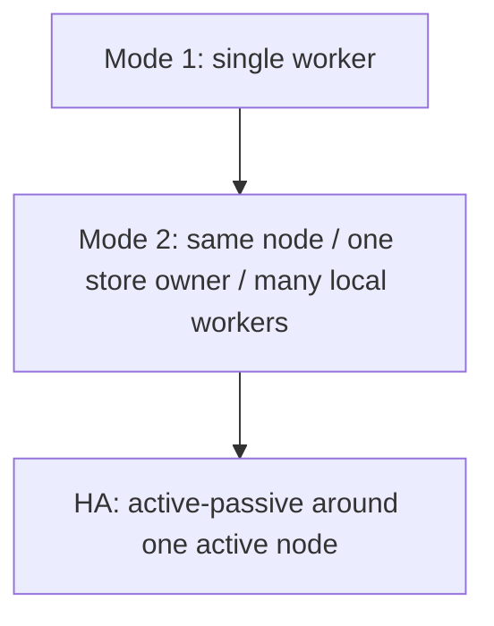
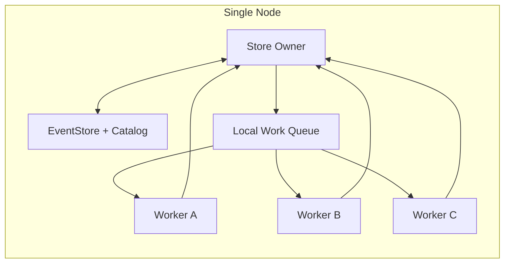
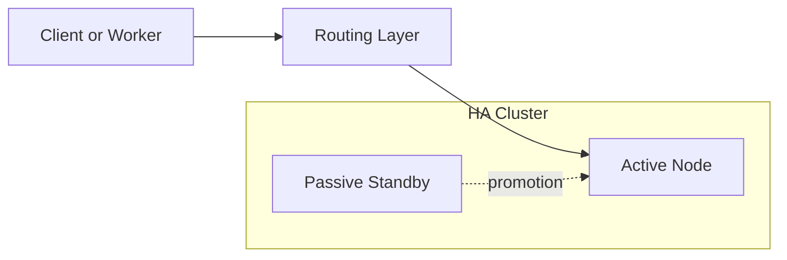

# Task: Operating Modes and HA for `events`

## Summary

This task closes out the scaling discussion for the `events` crate.

The supported shape should be:

- `Mode 1`: single worker
- `Mode 2`: multiple workers within the same node
- HA as active/passive failover around a single active node

The unsupported shape should be:

- direct cross-node scale-out against the same store
- active/active writers
- multi-process shared ownership of the same Turso store

The main design conclusion is simple:

- treat `events` as a single-owner event store
- if more local compute is needed, parallelize work inside one node
- if resilience is needed, use active/passive HA, not active/active scale-out

## Why This Exists

The earlier discussion mixed three different goals:

1. local checkpointed processing
2. local parallelism
3. multi-node scale-out

Those are not the same thing.

For this crate, the clean boundary is:

- local modes are supported directly
- HA can be built around a single active owner
- true distributed scale-out is out of scope

## Current Constraints

### Storage topology today

- `EventStore::open_partitioned()` opens a local filesystem root
- `Catalog::open()` opens a local `catalog.db`
- partition databases are local files under the same root

So the current store is fundamentally local-disk rooted.

### Consumer progression today

- `bootstrap_cursor()` loads the last saved checkpoint
- `checkpoint()` persists the next cursor
- the default projector path is checkpoint-driven

So the default behavior is already single-owner and restart-oriented.

### Constraint that matters

Turso should be treated here as a single-owner local database engine, not as a distributed coordination or shared multi-process substrate.

That means:

- one store owner should directly open and use the event store
- other workers should interact through that owner, not by opening the same store themselves

## Supported Modes

| Mode     | Topology                                      | What scales   | What owns the store |
| -------- | --------------------------------------------- | ------------- | ------------------- |
| `Mode 1` | one node, one worker                          | nothing       | one worker          |
| `Mode 2` | one node, one store owner, many local workers | local compute | one store owner     |

## Diagram: Operating Modes



## Mode 1: Single Worker

### Topology

- one node
- one process
- one consumer
- one direct owner of `EventStore` and `Catalog`

### Processing loop

```text
bootstrap_cursor
  -> all_since
  -> process batch
  -> checkpoint
  -> repeat
```

### Properties

- simplest operating mode
- no internal coordination layer
- restart from checkpoint after crash
- at-least-once semantics if failure happens after side effects but before checkpoint

### Use this when

- only one projector instance is needed
- throughput is already sufficient
- the lowest operational complexity is preferred

## Mode 2: Multiple Workers Within the Same Node

### Goal

Increase local compute parallelism without introducing distributed ownership.

### Topology

- one node
- one store-owning runtime
- many local worker executors
- one local dispatch queue

The important boundary is:

- the store owner opens and uses `EventStore` and `Catalog`
- worker executors do not directly open the store

### Processing model

The store owner remains responsible for:

- `bootstrap_cursor()`
- reading batches with `all_since()`
- tracking in-flight work
- applying monotonic checkpoints
- handling retries and reassignment after local worker failure

The local workers are responsible for:

- CPU-heavy event handling
- business logic execution
- producing result or failure back to the store owner

### Flow

```text
store owner reads next batch
  -> store owner dispatches work locally
  -> local workers process events
  -> workers return completion or failure
  -> store owner decides next checkpoint
  -> store owner checkpoints
```

### Important rules

- only the store owner touches the event store directly
- local workers are compute executors, not storage peers
- checkpointing stays single-owner and monotonic
- event handlers must remain idempotent
- ordering-sensitive projections may still need serialized handling even inside one node

### Diagram: Same-Node Worker Pool



### What this mode is and is not

This mode is:

- local parallelism
- one store owner with many local executors
- a way to use more CPU on one node

This mode is not:

- multiple nodes opening the same store
- active/active ownership
- distributed consumer-group coordination

## HA Solution

### Goal

Provide resilience without changing the single-owner model.

### Shape

HA should be active/passive:

- one active node owns the store
- one or more standby nodes stay warm
- a promoted standby becomes the new single active owner after failure

This is an availability pattern, not a scale-out pattern.

### Practical architecture

- the active node is the only node that serves direct event-store operations
- standbys keep enough state warm to take over
- promotion chooses exactly one new active node
- stale old actives must be fenced off after promotion

### Traffic model

All direct event-store traffic should go to the active node:

- append
- `bootstrap_cursor`
- `all_since`
- `checkpoint`
Standby nodes should not serve those operations until promoted.

### Diagram: Active/Passive HA



### Promotion requirements

The HA layer needs:

- a single active-node record
- a monotonic fencing token or equivalent epoch
- promotion logic that makes stale actives harmless
- replay or reroute of requests to the active node

## Out of Scope

The following are out of scope for the crate itself:

- direct multi-node scale-out
- many nodes reading and writing the same store in parallel
- active/active event-store ownership
- treating Turso as a distributed shared store for many independent workers

If those become requirements, the answer is no longer "use the crate differently"; it is "introduce a service boundary or change the storage architecture."

## Decision

The document should end on three clear statements:

- `events` supports a single-worker mode directly
- `events` can support multiple workers within the same node if one local owner mediates store access
- HA should be built as active/passive around one active owner, not as direct distributed scale-out
